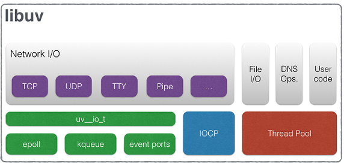
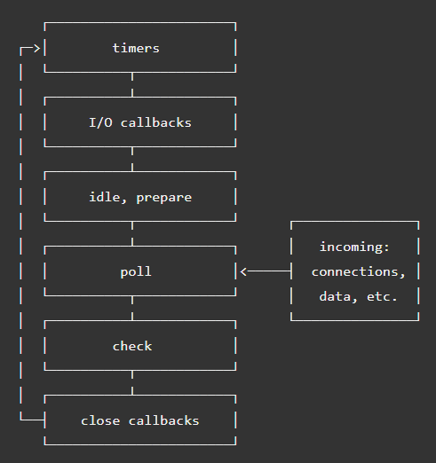
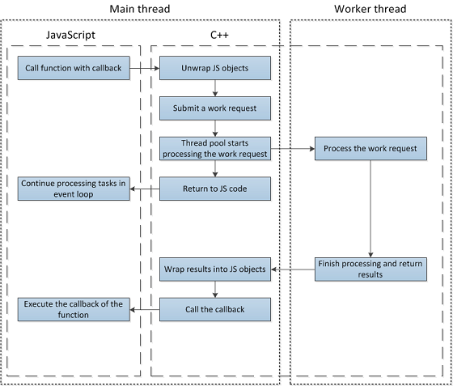

# Node.js Event Loop

**Libuv is the library that provides the event loop to Node.js.**

## Misconceptions

1. The event loop runs in a separate thread than the user code

    **Misconception** 
    There is a main thread where the JavaScript code of the user (userland code) runs in and another one that runs the event loop.  
    Every time an asynchronous operation takes place, the main thread will hand over the work to the event loop thread and once it is done, the event loop thread will ping the main thread to execute a callback.

    **Reality** 
    There is only one thread that executes JavaScript code and this is the thread where the event loop is running.  
    The execution of callbacks (know that every userland code in a running Node.js application is a callback) is done by the event loop. 

2. Everything that’s asynchronous is handled by a thread pool

    **Misconception** 
    Asynchronous operations, like working with the filesystems, doing outbound HTTP requests or talking to databases are always loaded off to a thread pool provided by libuv.

    **Reality** 
    Libuv by default creates a thread pool with four threads to offload asynchronous work to.  
    Today’s operating systems already provide asynchronous interfaces for many I/O tasks (e.g. AIO on Linux). 
    Whenever possible, libuv will use those asynchronous interfaces, avoiding usage of the thread pool.  
    The same applies to third party subsystems like databases.  
    Here the authors of the driver will rather use the asynchronous interface than utilizing a thread pool. 
    *In short: Only if there is no other way, the thread pool will be used for asynchronous I/O.*

3. The event loop is something like a stack or queue

    **Misconception** 
    The event loop continuously traverses a FIFO of asynchronous tasks and executes the callback when a task is completed.

    **Reality** 
    While there are queue-like structures involved, the event loop does not run through and process a stack.  
    The event loop as a process is a set of phases with specific tasks that are processed in a round-robin manner.

## Understanding the phases of an event loop cycle

To really understand the event loop we have to understand which work is done in which phase.   
Showing how the event loop works would be as follows:  

* Timers

    Everything that was scheduled via setTimeout() or setInterval() will be processed here.

* IO Callbacks

    Here most of the callbacks will be processed.   
    As all userland code in Node.js is basically in callbacks (e.g a callback to an incoming http request triggers a cascade of callbacks), this is the userland code.

* IO Polling

    Polls for new events to be processed on the next run.

* Set Immediate
    
    Runs all callbacks registered via setImmediate().

* Close

    Here all on(‘close’) event callbacks are processed.

    

## Threads in Node.js

refer from [What you should know to really understand the Node.js Event Loop](https://medium.com/the-node-js-collection/what-you-should-know-to-really-understand-the-node-js-event-loop-and-its-metrics-c4907b19da4c)