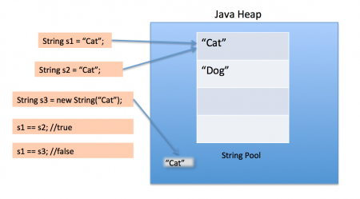

# String Pool



String Pool is possible only because String is immutable in Java and it’s implementation of String interning concept. 

String pool is also example of Flyweight design pattern.

String pool helps in saving a lot of space for Java Runtime although it takes more time to create the String.

When create a String using a literal, the system will search that pool and check if the value of the literal exists in a String object of the pool. 
If it does, it returns the reference to that matching object. 
If not, it creates a new String object and stores it in the pool. 

When create a String using the new operator, it creates a new String object in the heap, not in the pool.

When use intern() method:
```
String str = new String("abc");
String str1 = str.intern();
```
Then the str1 will point to the matching object.


Because Strings are immutable, when using + operator to concatenate two strings, a brand new String is created.
```
String str1 = "abc";
String str2 = "ab";
str2 = str2+"c";
System.out.println(str1 == str2); //false
                                  //same as new operator
```


# Difference Between String , StringBuilder And StringBuffer

* String

    String is immutable object. The object created as a String is stored in the Constant String Pool. 
    Every immutable object in Java is thread safe, that implies String is also thread safe. 
    String can not be used by two threads simultaneously.
    String once assigned can not be changed.

* StringBuffer

    StringBuffer is mutable means one can change the value of the object. 
    The object created through StringBuffer is stored in the heap. 
    StringBuffer has the same methods as the StringBuilder, but each method in StringBuffer is synchronized that is StringBuffer is thread safe . 

* StringBuilder

    StringBuilder is not thread safe. 
    StringBuilder is faster as it is not thread safe.

|                  | String               | StringBuffer     | StringBuilder    |
|------------------|:---------------------|:-----------------|:-----------------|
| Storage Area     | Constant String Pool | Heap             | Heap             |
| Modifiable       | No(immutable)        | Yes(mutable)     | Yes(mutable)     |
| Thread Safe      | Yes                  | Yes              | No               |
| Performance      | Fast                 | Very slow        | Fast             |